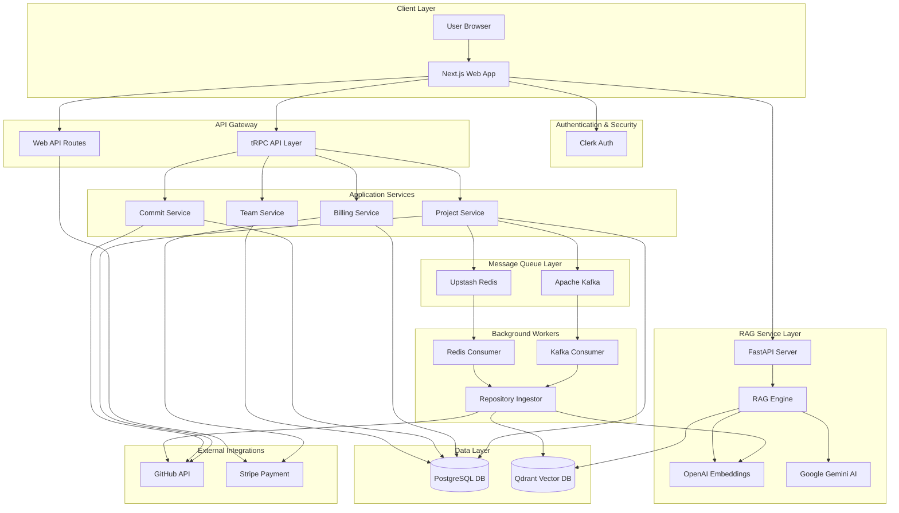
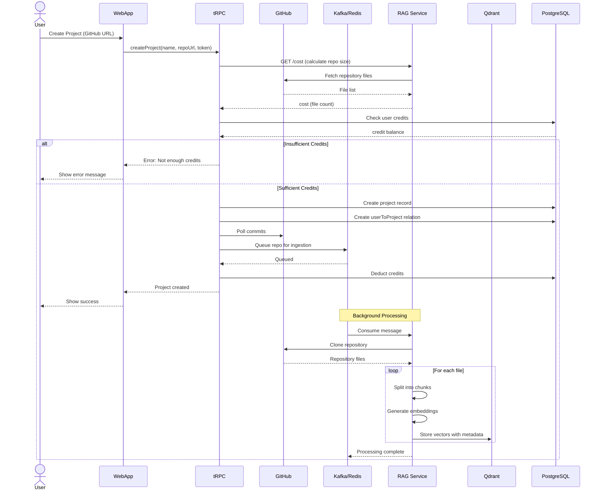
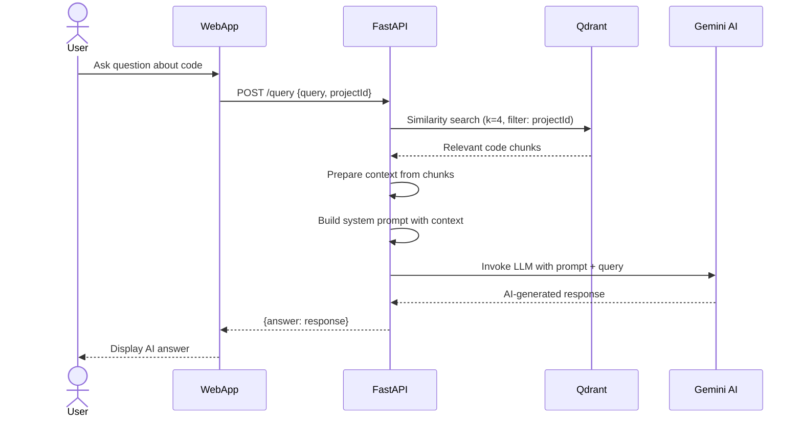
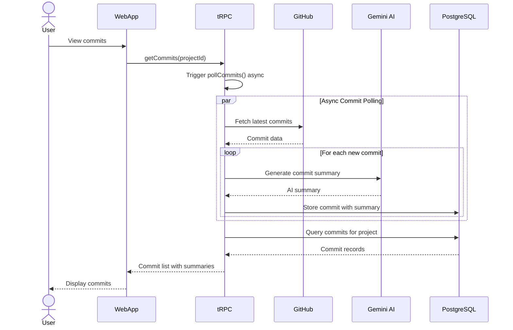
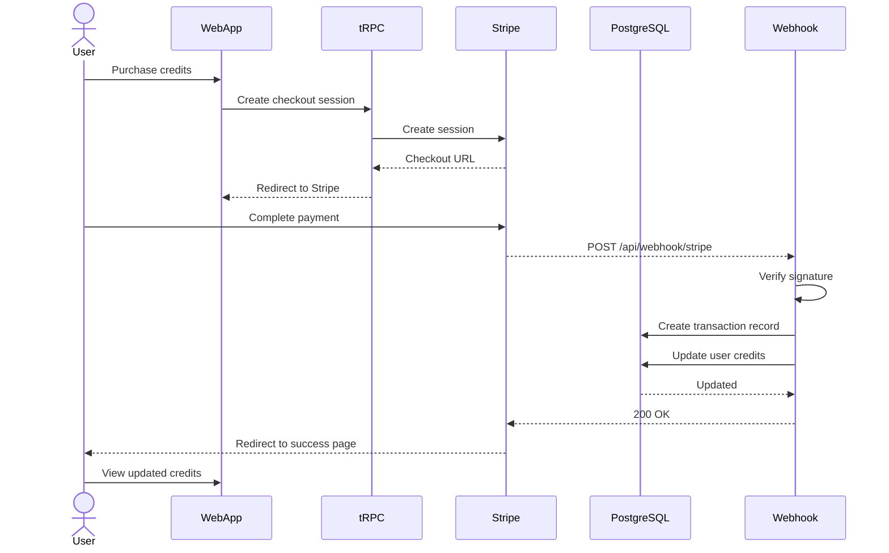

# DevSync - Project Documentation

## 📋 Project Overview

**DevSync** is an AI-powered GitHub repository analysis and Q&A platform that enables developers to interact with their codebase using natural language. The system ingests GitHub repositories, processes them using RAG (Retrieval-Augmented Generation) architecture, and provides intelligent responses to code-related queries.

### Key Features
- 🔍 GitHub repository integration and analysis
- 💬 AI-powered Q&A chatbot for codebase queries
- 📊 Commit tracking and analysis with AI summaries
- 👥 Team collaboration and project sharing
- 💳 Credit-based billing system with Stripe integration
- 🔐 Secure authentication with Clerk
- 🚀 Real-time repository ingestion via Kafka/Redis

---

## 🛠️ Tech Stack

### **Frontend/Web Application**
- **Framework**: Next.js 16.0 (React 19.2)
- **UI Library**: 
  - Radix UI components
  - Tailwind CSS 4.0
  - Lucide React (icons)
  - Shadcn UI components
- **State Management**: 
  - TanStack Query (React Query)
  - tRPC (Type-safe API)
- **Authentication**: Clerk (@clerk/nextjs)
- **Themes**: next-themes (Dark/Light mode)
- **Forms**: React Hook Form with Zod validation

### **Backend/API**
- **API Layer**: tRPC v11 (Type-safe APIs)
- **Database ORM**: Prisma 6.5
- **Database**: PostgreSQL
- **Runtime**: Node.js with Bun package manager

### **RAG (Retrieval-Augmented Generation) Service**
- **Framework**: FastAPI (Python)
- **AI/ML Stack**:
  - LangChain (1.1.3)
  - LangGraph (graph-based workflows)
  - Google Gemini AI (gemini-2.5-flash-lite)
  - OpenAI Embeddings (text-embedding-3-large)
- **Vector Database**: Qdrant
- **Message Queue**: Apache Kafka / Redis
- **GitHub Integration**: PyGithub, Octokit

### **Infrastructure & DevOps**
- **Containerization**: Docker (docker-compose)
- **Caching**: Upstash Redis
- **Payment Processing**: Stripe
- **Code Quality**: ESLint, Prettier, TypeScript

### **Key Libraries**
- **Text Processing**: RecursiveCharacterTextSplitter
- **HTTP Client**: Axios, Fetch API
- **Code Analysis**: LangChain text splitters

---

## 📦 Project Modules

### **1. Web Application (`/webapp`)**

#### **Authentication Module**
- **Location**: `src/app/sign-in`
- **Features**: 
  - Clerk-based authentication
  - User session management
  - Protected routes

#### **Dashboard Module**
- **Location**: `src/app/(protected)/dashboard`
- **Components**:
  - `archive-button.tsx` - Archive projects
  - `ask-question-card.tsx` - Quick Q&A interface
  - `commit-log.tsx` - Display commit history
  - `invite-button.tsx` - Team invitations
  - `team-members.tsx` - Team management
- **Features**:
  - Project overview
  - Recent commits with AI summaries
  - Team member management
  - Quick access to Q&A

#### **Project Creation Module**
- **Location**: `src/app/(protected)/create`
- **Features**:
  - GitHub repository URL input
  - Repository cost calculation
  - Credit validation
  - Project initialization

#### **Q&A/Chat Module**
- **Location**: `src/app/(protected)/qa`
- **Features**:
  - Interactive chat interface
  - RAG-based code querying
  - Context-aware responses
  - Message history

#### **Billing Module**
- **Location**: `src/app/(protected)/billing`
- **Features**:
  - Credit purchase
  - Stripe payment integration
  - Transaction history
  - Credit balance display

#### **API Routes**
- **tRPC Router**: `src/app/api/trpc/[trpc]/route.ts`
- **Stripe Webhook**: `src/app/api/webhook/stripe/route.ts`

#### **Server Layer**
- **Location**: `src/server/api`
- **Routers**:
  - `projects.ts` - Project CRUD operations
  - `post.ts` - Generic post operations
- **Core**: 
  - `trpc.ts` - tRPC configuration
  - `root.ts` - Root router

#### **Database Layer**
- **Location**: `src/server/db.ts`
- **ORM**: Prisma Client
- **Schema**: `prisma/schema.prisma`

#### **Libraries & Utilities**
- **Location**: `src/lib`
- **Files**:
  - `github.ts` - GitHub API integration
  - `github-loader.ts` - Repository loading
  - `gemini.ts` - AI integration
  - `kafka.ts` - Kafka producer
  - `redis.ts` - Redis queue
  - `stripe.ts` - Payment processing
  - `stripe-session.ts` - Session management

---

### **2. RAG Service (`/rag`)**

#### **API Server Module**
- **Location**: `src/main.py`
- **Endpoints**:
  - `POST /query` - Process user queries
  - `GET /cost` - Calculate repository cost
  - `GET /` - Health check
- **Features**:
  - CORS support
  - FastAPI async processing

#### **Ingestion Module**
- **Location**: `src/utils/ingestor.py`
- **Features**:
  - Document chunking (1000 chars, 200 overlap)
  - Vector embedding generation
  - Qdrant storage
  - Batch processing (5 vectors/batch)

#### **Chat/Query Module**
- **Location**: `src/utils/chat.py`
- **Features**:
  - Similarity search (k=4)
  - Context preparation
  - AI response generation
  - Project filtering

#### **Repository Loader**
- **Location**: `src/utils/load_repo.py`
- **Features**:
  - GitHub repository cloning
  - File filtering (ignore patterns)
  - Document creation

#### **Message Queue Consumers**
- **Kafka Consumer**: `src/kafka-consumer.py`
- **Redis Consumer**: `src/redis_consumer.py`
- **Features**:
  - Async repository processing
  - Vector database ingestion
  - Error handling

---

## 🏗️ High-Level Design (HLD)



---

## 🔄 System Flow Diagram

### **1. Project Creation & Repository Ingestion Flow**



### **2. Q&A / Chat Query Flow**



### **3. Commit Tracking Flow**



### **4. Billing & Credit Purchase Flow**



---

## 🗄️ Entity Relationship (ER) Diagram


### **Database Schema Details**

#### **User Table**
- Stores user authentication and profile information
- Tracks credit balance for project creation
- Links to Stripe customer ID for payment processing

#### **Project Table**
- Represents GitHub repositories added to the system
- Supports soft deletion via `deletedAt` timestamp
- Stores GitHub repository URL for integration

#### **userToProject Table**
- Junction table for many-to-many relationship
- Enables team collaboration on projects
- Unique constraint on (userId, projectId) pair

#### **Commit Table**
- Stores commit history for each project
- Includes AI-generated summaries for each commit
- Links to project via foreign key

#### **StripeTransactions Table**
- Audit trail for all credit purchases
- Links to user for transaction history
- Records credit amount purchased

---

## 🔐 Security Features

1. **Authentication**: Clerk-based secure authentication
2. **Authorization**: Protected routes with middleware
3. **API Security**: tRPC with type-safe procedures
4. **Payment Security**: Stripe webhook signature verification
5. **Environment Variables**: Sensitive data in `.env` files
6. **CORS Configuration**: Controlled cross-origin requests

---

## 🚀 Deployment Architecture

### **Development Environment**
- Local PostgreSQL via Docker Compose
- Local Qdrant instance
- Kafka for message queuing
- Next.js development server

### **Production Environment**
- Cloud-hosted PostgreSQL
- Managed Qdrant Cloud
- Upstash Redis (serverless)
- Vercel/Cloud deployment for Next.js
- Containerized RAG service

---

## 📊 Key Metrics & Performance

- **Chunk Size**: 1000 characters with 200 overlap
- **Vector Dimensions**: 3072 (OpenAI text-embedding-3-large)
- **Similarity Search**: k=4 (top 4 relevant chunks)
- **Batch Processing**: 5 vectors per batch for Qdrant upload
- **Default Credits**: 2000 per new user

---

## 🔧 Configuration

### **Environment Variables**

#### Web Application
```env
DATABASE_URL=postgresql://...
CLERK_SECRET_KEY=...
NEXT_PUBLIC_CLERK_PUBLISHABLE_KEY=...
GITHUB_ACCESS_TOKEN=...
NEXT_PUBLIC_API_SERVER=http://localhost:8000
NEXT_PUBLIC_WORKER_SERVER=...
STRIPE_SECRET_KEY=...
UPSTASH_REDIS_URL=...
ENV=DEVELOPMENT|PRODUCTION
```

#### RAG Service
```env
GOOGLE_API_KEY=...
OPENAI_API_KEY=...
GITHUB_TOKEN=...
QDRANT_HOST=http://localhost:6333
QDRANT_HOSTP=... (production)
QDRANT_API_KEYP=... (production)
ENV=DEVELOPMENT|PRODUCTION
```

---

## 📝 API Endpoints

### **tRPC Procedures**
- `createProject` - Create new project from GitHub URL
- `getProjects` - Fetch user's projects
- `archiveProject` - Soft delete a project
- `getCommits` - Retrieve commit history
- `getMyCredits` - Get user credit balance
- `getMyTransactions` - Fetch transaction history
- `getTeamMembers` - Get project team members

### **RAG Service Endpoints**
- `GET /` - Health check
- `POST /query` - Process Q&A queries
- `GET /cost` - Calculate repository ingestion cost

### **Webhook Endpoints**
- `POST /api/webhook/stripe` - Stripe payment webhooks

---

## 🎯 Future Enhancements

Based on `todo.md`:
1. ✅ Update embedding key
2. 🔄 Webhook and update mechanisms
3. 🔄 Pull request integration
4. 🔄 Invite user and team member features
5. 🔄 Enhanced questions component
6. 🔄 UI/UX revamp

---

## 📚 Technology Documentation Links

- [Next.js](https://nextjs.org/docs)
- [tRPC](https://trpc.io/docs)
- [Prisma](https://www.prisma.io/docs)
- [LangChain](https://js.langchain.com/docs/)
- [Qdrant](https://qdrant.tech/documentation/)
- [FastAPI](https://fastapi.tiangolo.com/)
- [Clerk](https://clerk.com/docs)
- [Stripe](https://stripe.com/docs)
- [Google Gemini](https://ai.google.dev/docs)

---

**Generated**: December 18, 2025  
**Project**: DevSync - AI-Powered GitHub Repository Analysis Platform
